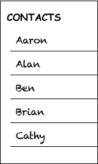
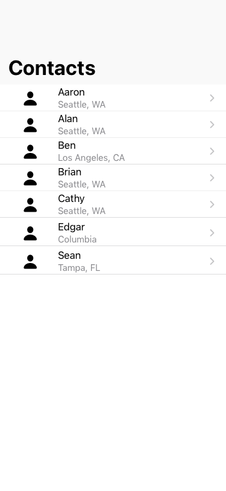
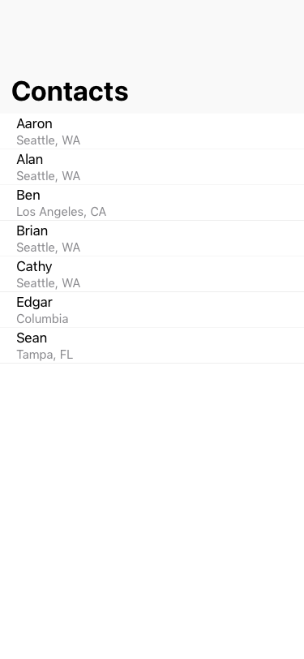
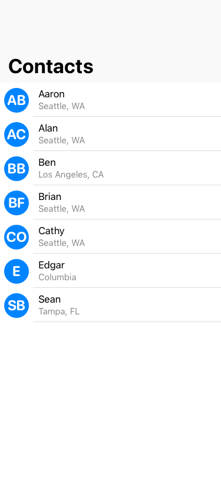

# Creating a custom View Model

Throughout the document, we will be using a `Contact` data structure:
```swift
struct Contact {
    var identifier: UUID
    var name: String
    var phone: String
    var address: String
    var email: String
}
```

## OBAListViewItem
`OBAListViewItem` is the protocol view model that contains many standard features,
- Stable identity (`hash(into:_)`)
- Equality check (`==` operator)
- Cell configuration details (`contentConfiguration`)
- Common user interaction actions (`onSelectAction` and `onDeleteAction`)
- Contextual actions (`leadingContextualActions` and `trailingContextualActions`)

# Example
Let's say we want to display a list of our contacts names,



## Example A - Default cell configuration

First, create the view model that conforms to `OBAListViewItem`,
```swift
struct ContactViewModel: OBAListViewItem {
    var id: UUID
    var name: String
    var address: String

    // 1
    var onSelectAction: OBAListViewAction<ContactViewModel>?

    // 2
    var contentConfiguration: OBAContentConfiguration {
        return OBAListRowConfiguration(
            image: UIImage(systemName: "person.fill"), 
            text: name, 
            secondaryText: address, 
            appearance: .subtitle, 
            accessoryType: .disclosureIndicator)
    }

    init(_ contact: Contact) {
        self.id = contact.id
        self.name = contact.name
        self.address = contact.address
    }
 
    // 3
    func hash(into hasher: inout Hasher) {
        hasher.combine(id)
    }

    static func == (lhs: ContactViewModel, rhs: ContactViewModel) -> Bool {
        return lhs.id == rhs.id && 
            lhs.name == rhs.name &&
            lhs.address == rhs.address
    }
}
```

1. `onSelectAction?` is required by OBAListViewItem. The closure is called when the user taps or left-clicks on the cell.
2. `contentConfiguration` provides the cell configuration, similar to `UIContentConfiguration`. In this example, we are using the ready-to-use `OBAListRowConfiguration` which configures the cell in a `UITableViewCell` style.
3. `hash(:_)` should be implemented as an identity check. In any given `OBAListView`, each item in the list must have a unique identity. In this example, the identity of `Contact` is determined by its `id` property.

The result should look something like this:

<details>
    <summary>Click to view screenshot</summary>
    
</details>

## Example B - Custom cell configuration (simple)
When the default cell configuration (`OBAListRowConfiguration`) does not provide enough functionality, you can create a custom cell configuration, akin to a subclassing `UICollectionViewCell`.

First, create the cell configuration. This is where you define the cell's properties,
```swift
struct ContactContentConfiguration: OBAContentConfiguration {
    // 1
    var formatters: Formatters?

    var name: String
    var address: String

    // 2
    var obaContentView: (OBAContentView & ReuseIdentifierProviding).Type {
        return ContactCell.self
    }
}
```
1. `formatters` is a requirement of `OBAContentConfiguration`, but is irrelevant to this example. See [Example C] to read more about `formatters`.
2. We need to specify the type of the UIView that is responsible for displaying the data. In the case of `OBAContactConfiguration`, it has to be an `OBAContentView`.

Second, create the custom cell,
```swift
// 1
final class ContactCell: OBAListViewCell {
    weak var nameLabel: UILabel!
    weak var addressLabel: UILabel!

    // ... omitted UIView methods ...

    // 2
    override func apply(_ config: OBAContentConfiguration) {
        guard let config = config as? ContactContentConfiguration else { return } // 3
        nameLabel.text = config.name
        addressLabel.text = config.address
    }

    override func prepareForReuse() {
        super.prepareForReuse()
        nameLabel.text = nil
        addressLabel.text = nil
    }
}
```

1. `OBAListView` requires cells to subclass `OBAListViewCell`. `OBAListViewCell` provides boilerplate implementation for safety and consistency (i.e. `ReuseIdentifier`s based on type name).
2. `apply(:_)` uses the content configuration's properties to configure the view.
3. If the matching content configuration isn't the expected configuration, gracefully exit the method without changing the view. You don't need to call `prepareForReuse()` since `OBAListView` will call `prepareForReuse()` before `apply(:_)`.

Third, specify the custom cell type in the view model,
```swift
struct ContactViewModel: OBAListViewItem {
    // ... omitted implemention from Example A ...
    static var customCellType: OBAListViewCell.Type? {
        return ContactCell.type
    }
}
```

Finally, you will need to register the custom cell type with `OBAListView` **before** you use it. You can do this with the following helper function,

```swift
override func viewDidLoad() {
    // ... omitted ...
    listView.register(listViewItem: ContactViewModel.self)
}
```

The result should look something like this:
<details>
    <summary>Click to view screenshot</summary>
    
</details>

## Example C - Custom cell configuration (with formatters)
Note: This section requires knowledge of OBAKit's `Formatters` and `Application` classes.

`OBAListView` recognizes that app internationalization will require localizing data for a positive user-experience. Since localization settings are typically set by the user on the operating system, it is encouraged that localized data is kept out of the view model (`OBAListViewItem`).

In addition, `NSFormatter`s are relatively expensive to initialize and compute, so we lazily initialize all formatters in `application.formatters`. OBAListView can then use the formatters accordingly.

The graph below is a high-level overview of the responder chain's relationship to `OBAListView` and its view controller,

```
# use `dot` engine to render.
digraph G {
    graph [rankdir=LR]
        
    subgraph cluster_0 {
        parentvc [
            label="<f0>class ContactsListViewController: \nUIViewController, \nAppContext | <f1>application | <f2>listView | <f3> | <f4> viewDidLoad(:_)"
            shape=record
        ]
        
        listview [
            label="<f0>class OBAListView: UICollectionView | <f1>formatters?"
            shape=record
        ]
        
        
        parentvc:f2 -> listview:f0:n
        parentvc:f4 -> listview:f1 [label="sets to application.formatters"]
        
        label="Initialization"
        color=blue
        style=dashed
    }
    
    subgraph cluster_1 {
        operatingsystem [label="iOS/Catalyst"]
        app [label="UIApplication"]
        
        obaapplication [
            label="<f0>OBAApplication | <f1>formatters"
            shape=record
        ]
        
        operatingsystem -> app [label="notifies"]
        app -> obaapplication:f1 [label="notifies"]
        
        // app:n -> parentvc:f0 [label="notifies"]
        
        label="User changes a setting\n(e.g. font size)"
        color=red
        style=dashed
    }
    
    parentvc:f1 -> obaapplication:f0 [style=dashed]
    obaapplication:f1->listview:f1 [style=dashed]
}
```

```swift
struct ContactContentConfiguration: OBAContentConfiguration {
    // ... omitted implementation from Example B ...

    // 1
    var initials: String? {
        // 2
        guard let formatters = self.formatters else { return nil }
        guard let components = formatters
            .abbreviatedPersonNameFormatter
            .personNameComponents(from: name) else { 
            return nil 
        }
        
        return formatters.abbreviatedPersonNameFormatter.string(from: components)
    }
}
```

1. You can't have a `lazy` property on an immutable copy, and setting the property during initialization can have a heavy performance hit in large lists. In this example, and in most cases, use a computed property.
2. `formatters` is an optional, this happens when the engineer does not set the `formatters` property on the parent `OBAListView`.

The result should look something like this:
<details>
    <summary>Click to view screenshot</summary>
    
</details>


# Other notes
## Conforming an existing data structure to OBAListViewItem
A custom view model should not directly reference its data model,
```swift
struct ContactViewModel: OBAListViewItem {
    var contact: Contact                // <- Do not do this!!!
    // ... omitted ...
}
```
or be directly implemented into an existing data structure,
```swift
extension Contact: OBAListViewItem {    // <- Do not do this!!!
    // ... omitted ...
}
```

The purpose of the view model is to only include data relevant to the specific view:
- If `Contact` was a `struct`, it would be including extranous data.
- If `Contact` was a `class`, it becomes liable to race conditions.
- In both cases, performance is not the issue because Swift is copy-on-write, but rather an architectural choice to separate the View Model from the Data Model.

## Custom headers
Currently, you cannot create custom header views. 

A workaround is to create a custom view model `OBAListViewItem` to hold the header view and provide that as the first item in the section's contents. Make sure to provide a `nil` title to stop the default header from appearing.

```swift
OBAListViewSection(id: "contacts_section", title: nil, contents: [CustomHeaderViewModel(), contents...])
```

Note, that you will lose section header features that `OBAListView` provides, such as collapsible headers or sticky headers.
