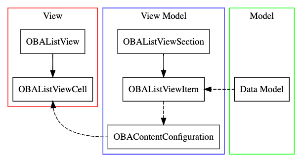

# OBAListView
This document assumes prior knowledge of UITableView/UICollectionView.

OBAListView was heavily influenced by IGListKit and UIDiffableDataSource.

The motivation for developing OBAListView comes from:
- Reducing third-party dependencies in OBAKit
- A consistent method for displaying a list of frequently-updated data
- Consistant implementation of operating system user-interactive features (i.e. context menus)
- iOS 13 support (UIContentConfiguration and related is iOS 14+)



# Getting Started

The following example demostrates the barebones approach to displaying a list of data with a UITableViewCell style.
```swift
class ViewController: UIViewController, OBAListViewDataSource {
    let names: [String] = [
        "Aaron",
        "Alan",
        "Brian",
        "Ben",
        "Edgar",
        "Kathy",
        "Sean"
    ]

    let listView = OBAListView()

    // MARK: - UIViewController methods
    override func viewDidLoad() {
        super.viewDidLoad()

        listView.obaDataSource = self   // this is `obaDataSource`, not `dataSource`
        view.addSubview(listView)

        // Pins listView to the superview.
        NSLayoutConstraint.activate([
            listView.topAnchor.constraint(equalTo: view.topAnchor),
            listView.bottomAnchor.constraint(equalTo: view.bottomAnchor),
            listView.trailingAnchor.constraint(equalTo: view.trailingAnchor),
            listView.leadingAnchor.constraint(equalTo: view.leadingAnchor)
        ])
    }

    override func viewWillAppear(_ animated: Bool) {
        super.viewWillAppear(animated)

        // 1
        listView.applyData()        
    }

    // MARK: - OBAListViewDataSource methods
    func items(for listView: OBAListView) -> [OBAListViewSection] {
        // 2
        let viewModels = names.map { name -> OBAListRowView.DefaultViewModel in
            OBAListRowView.DefaultViewModel(title: name)
        }
        return [OBAListViewSection(id: "names", title: "Names", contents: viewModels)]
    }
}
```

1. Tells `OBAListView` to update the list from its `dataSource` using the items from `items(:_)`. `applyData()` will update the list based on its diff, as determined by [`UICollectionViewDiffableDataSource`](apple_uicollectionviewdiffabledatasource).
2. `OBAListView` provides ready-to-use view models for displaying trival information in a `UITableViewCell` style.

[apple_uicollectionviewdiffabledatasource]: https://developer.apple.com/documentation/uikit/uicollectionviewdiffabledatasource