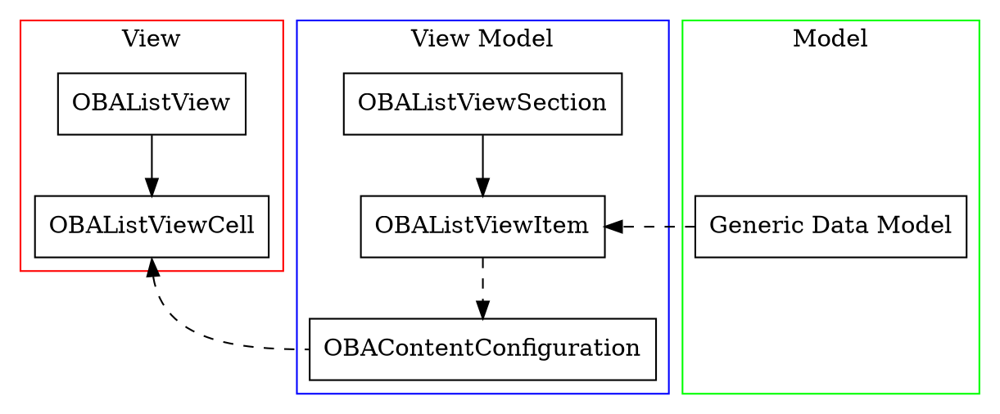

# OBAListView
This document assumes prior knowledge of UITableView/UICollectionView.

OBAListView was heavily influenced by IGListKit and UIDiffableDataSource.

The motivation for developing OBAListView comes from:
- Reducing third-party dependencies in OBAKit
- A consistent method for displaying a list of frequently-updated data
- Consistant implementation of operating system user-interactive features (i.e. context menus)
- iOS 13 support (UIContentConfiguration and related is iOS 14+)

## Architecture
<svg viewBox="0 0 506 244.8" xmlns="http://www.w3.org/2000/svg"><g class="graph" transform="translate(4 240.8)"><path fill="#fff" stroke="transparent" d="M-4 4v-244.8h506V4H-4z"/><g class="cluster"><path fill="none" stroke="red" d="M8-80v-148.8h136V-80H8z"/><text text-anchor="middle" x="76" y="-212.2" font-family="Times,serif" font-size="14">View</text></g><g class="cluster"><path fill="none" stroke="#00f" d="M152-8v-220.8h184V-8H152z"/><text text-anchor="middle" x="244" y="-212.2" font-family="Times,serif" font-size="14">View Model</text></g><g class="cluster"><path fill="none" stroke="#0f0" d="M344-8v-220.8h146V-8H344z"/><text text-anchor="middle" x="417" y="-212.2" font-family="Times,serif" font-size="14">Model</text></g><g class="node"><path fill="none" stroke="#000" d="M124.6472-196H27.3528v36h97.2944v-36z"/><text text-anchor="middle" x="76" y="-173.8" font-family="Times,serif" font-size="14">OBAListView</text></g><g class="node"><path fill="none" stroke="#000" d="M136.479-124H15.521v36h120.958v-36z"/><text text-anchor="middle" x="76" y="-101.8" font-family="Times,serif" font-size="14">OBAListViewCell</text></g><g class="edge"><path fill="none" stroke="#000" d="M76-159.8314v25.4148"/><path stroke="#000" d="M79.5001-134.4132L76-124.4133l-3.4999-10 7 .0001z"/></g><g class="node"><path fill="none" stroke="#000" d="M328.4269-52H159.5731v36h168.8538v-36z"/><text text-anchor="middle" x="244" y="-29.8" font-family="Times,serif" font-size="14">OBAContentConfiguration</text></g><g class="edge"><path fill="none" stroke="#000" stroke-dasharray="5,2" d="M76.7805-77.7657C82.5319-42.1046 119.2585-34 160-34"/><path stroke="#000" d="M73.2707-77.7628L76-88l4.2504 9.7048-6.9797.5324z"/></g><g class="node"><path fill="none" stroke="#000" d="M305.8034-124H182.1966v36h123.6068v-36z"/><text text-anchor="middle" x="244" y="-101.8" font-family="Times,serif" font-size="14">OBAListViewItem</text></g><g class="edge"><path fill="none" stroke="#000" stroke-dasharray="5,2" d="M244-87.8314v25.4148"/><path stroke="#000" d="M247.5001-62.4132L244-52.4133l-3.4999-10 7 .0001z"/></g><g class="node"><path fill="none" stroke="#000" d="M313.6401-196H174.3599v36h139.2802v-36z"/><text text-anchor="middle" x="244" y="-173.8" font-family="Times,serif" font-size="14">OBAListViewSection</text></g><g class="edge"><path fill="none" stroke="#000" d="M244-159.8314v25.4148"/><path stroke="#000" d="M247.5001-134.4132L244-124.4133l-3.4999-10 7 .0001z"/></g><g class="node"><path fill="none" stroke="#000" d="M482.2781-124H351.7219v36h130.5562v-36z"/><text text-anchor="middle" x="417" y="-101.8" font-family="Times,serif" font-size="14">Generic Data Model</text></g><g class="edge"><path fill="none" stroke="#000" stroke-dasharray="5,2" d="M352-106h-36.2543"/><path stroke="#000" d="M315.6817-102.5001L305.6816-106l10-3.5001.0001 7z"/></g></g></svg>
<!--


-->

# Getting Started

The following example demostrates the barebones approach to displaying a list of data with a UITableView style.
```swift
class ViewController: UIViewController, OBAListViewDataSource {
    let names: [String] = [
        "Aaron",
        "Alan",
        "Kathy",
        "Sarah",
        "Sean"
    ]

    let listView = OBAListView()

    // MARK: - UIViewController methods
    override func viewDidLoad() {
        super.viewDidLoad()

        listView.obaDataSource = self   // this is `obaDataSource`, not `dataSource`
        view.addSubview(listView)

        // Pins listView to the superview.
        NSLayoutConstraint.activate([
            listView.topAnchor.constraint(equalTo: view.topAnchor),
            listView.bottomAnchor.constraint(equalTo: view.bottomAnchor),
            listView.trailingAnchor.constraint(equalTo: view.trailingAnchor),
            listView.leadingAnchor.constraint(equalTo: view.leadingAnchor)
        ])
    }

    override func viewWillAppear(_ animated: Bool) {
        super.viewWillAppear(animated)

        // Tells OBAListView to update the list using the items from `items(:_)`.
        listView.applyData()        
    }

    // MARK: - OBAListViewDataSource methods
    func items(for listView: OBAListView) -> [OBAListViewSection] {
        // OBAListView provides ready-to-use view models for
        // displaying trival information in a UITableViewCell style.
        let viewModels = names.map { name -> OBAListRowView.DefaultViewModel in
            OBAListRowView.DefaultViewModel(title: name)
        }
        return [OBAListViewSection(id: "names", title: "Names", contents: viewModels)]
    }
}
```